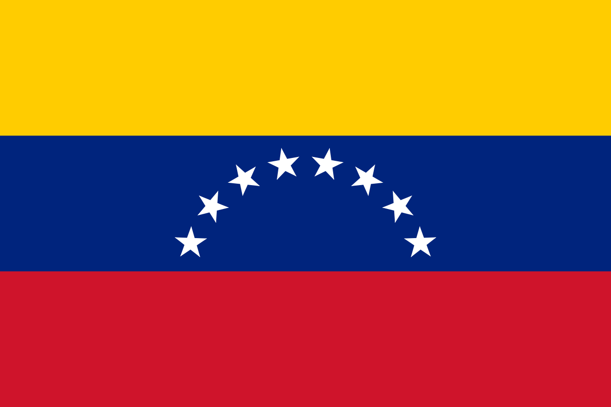

# DOC360

Añadir descripcion elaborada del producto

### Metodologia de Trabajo

Cada equipo tiene un readme incluido en su carpeta explicando el procedimiento para realizar cambios sobres las ramas que trabajen para luego integrarlas sobre las principales que serán, por un lado, "DEV" para deploys de prueba y "MAIN" para deploy de producción.

La forma de division de tareas se realizo mediante la utilización de  por cada sector con sus respectivas tareas y una épica aparte en la que participaran los jefes de cada equipo.

La comunicación oficial con el equipo se realizo mediante  y la comunicación diaria para procesos de desarrollo y reuniones habituales mediante 

#### Stack

##### Back End

  
swagger

##### Front End

  

##### QA Tester

##### Design

#### Equipo | S15-21-T-Python-React

| Nombre                                                                           | Posicion        | Contacto                                                                                                                                                                                                                                                                                                                           |
| -------------------------------------------------------------------------------- | --------------- | ---------------------------------------------------------------------------------------------------------------------------------------------------------------------------------------------------------------------------------------------------------------------------------------------------------------------------------- |
|  Nicolas Yopo         | Project Manager |                                |
|  Miguel Salazar       | Front End Lead  |                     |
|  Lorena Barrera        | Front End       |                                  |
|  Melania Palomino          | Front End       |                           |
|  Piero Ramirez             | Front End       |                         |
|  Julieta Mores        | Front End       |                          |
|  Marcelo Saiz         | Back End Lead   |                             |
|  Rober Rengel              | Back End        |       |
|  Rene Carrillo           | Back End        |                                       |
|  Natalia Caniza Toral | UX/UI Lead      |                                 |
|  Martin Villafañe     | UX/UI           |   |
|  Yosmarli Parica      | QA Tester Lead  |                    |
|  Paula Arellano       | QA Tester       |                               |
|  Esteban Montoya       | QA Tester       |                              |
